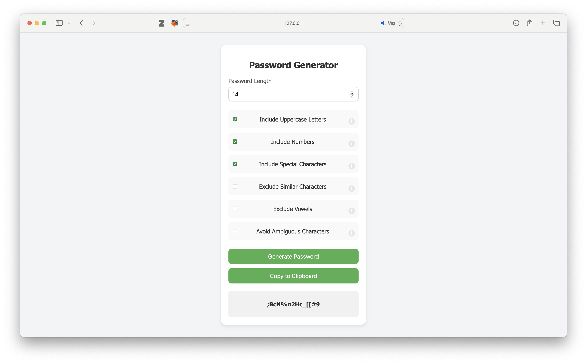

# Simple Self-Hosted Password Generator

A lightweight, and self-hosted password generator that runs entirely in a single HTML file. This tool provides a modern and easy-to-use interface for generating secure passwords with various customization options, such as length, inclusion of special characters, and exclusion of ambiguous or similar characters.

## Key Features

- **Single HTML File**: No need for external dependencies or additional files. Everything is contained in a single `passgen.html` file.
- **Customization Options**: Choose from a variety of password settings, such as including uppercase letters, numbers, and special characters, or excluding similar and ambiguous characters.
- **Instant Password Generation**: Quickly generate strong passwords directly in your browser.
- **Self-Hosted**: Easily host this tool on your server without any back-end requirements.
- **Copy to Clipboard**: Copy the generated password with a single click.

## How It Works

This password generator allows you to customize the following options:

- **Password Length**: Set the password length (minimum 4, maximum 64).
- **Include Uppercase Letters**: Toggle inclusion of uppercase letters (A-Z).
- **Include Numbers**: Toggle inclusion of numbers (0-9).
- **Include Special Characters**: Add special characters such as `!@#$%^&*()`.
- **Exclude Similar Characters**: Avoid characters that are easily confused, such as `I`, `l`, `1`, `O`, `0`.
- **Exclude Vowels**: Option to exclude vowels to prevent the formation of words.
- **Exclude Ambiguous Characters**: Avoid ambiguous symbols like `{ } [ ] ( ) / \ ' " ~ , ; : . < >`.

The generated password will be displayed in the output area and can be copied to the clipboard with a single click.

## Preview

## Installation Instructions

### Option 1: Run Locally in Browser

1. Clone the repository or download the `passgen.html` file.
2. Open `passgen.html` in any modern web browser.
3. The password generator will be fully functional locally, with no need for a web server.

### Option 2: Host on Your Web Server

1. Place the `passgen.html` file in the public directory of your web server. For example:
   - If using **Apache** or **Nginx**, place the `passgen.html` file in `/var/www/html/`.
   - For **cPanel** or shared hosting, upload `passgen.html` to the `public_html` directory.
   
2. Access the file through your browser by navigating to your server’s URL (e.g., `http://yourdomain.com/passgen.html`).

Once uploaded, users can open the page to generate passwords directly in their browser.

## Customization

Feel free to customize the password generator to suit your needs. Since it's all contained in a single HTML file, you can modify the styles, settings, and password generation logic by editing the `passgen.html` file. 

For example, to change the default password length or to adjust which characters are included, simply modify the JavaScript code embedded in the file.

## License

This project is licensed under the MIT License - see the [LICENSE](LICENSE) file for details.
